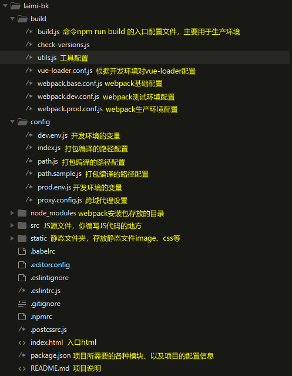
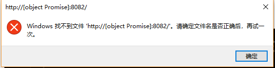
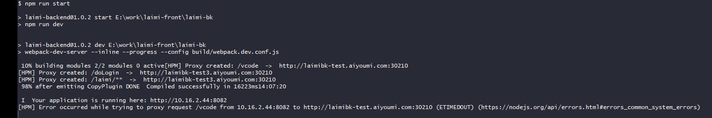
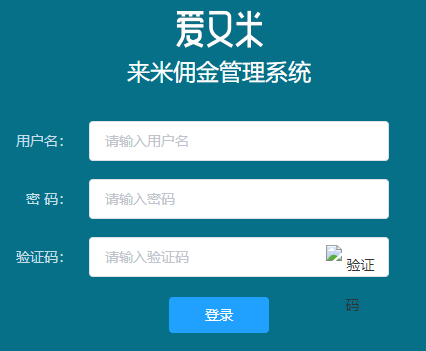

# vue-cli2升级webpack4记录
## 目录结构分析，找出配置文件
这个项目是由vue-cli2生成的，我们先来看看现有的目录结果，找出我们需要改代码的地方，打开各文件查看，找到我们需要修改文件的地方存于放build和config两个目录下：



这次我们修改的js文件主要有以下三个：
- ./build/webpack.dev.conf.js
- ./build/webpack.prod.conf.js
- ./config/webpack.prod.conf

## 在package.json中查找编译命令
```js
{
  "name": "laimi-backend",
  "version": "1.0.2",
  "description": "a project of laimi backend with Vue.js",
  "scripts": {
    "start": "npm run dev",
    "lint": "eslint --ext .js,.vue src",
    "dev": "webpack-dev-server --inline --progress --config build/webpack.dev.conf.js",
    "build": "node build/build.js"
  },
...
}
```
每个项目的根目录下，一般都有一个package.json文件，定义了这个项目需要的各种模块，以及项目的配置信息，scripts指定了运行脚本命令的npm命令行缩写，从这个文件中，我们找到了测试环境本地服务启动命令：
```js
npm run start
```
生产环境编译命令：
```js
npm run build
```

## 升级测试环境
#### 安装webpack和webpack-cli至最新版
在webpack3中，webpack本身和它的cli以前都在同一个包中，但在第4版中，它们两者已经分开，所以我们的webpack需要安装两个包:
1. 全局安装webpack至最新版
```
npm install webpack@4.23.1 -g
```
安装完成后出现版本号提示，说明安装成功，warning可以忽略，error表现没有安装成功，请重新再试。
2. 本地升级webpack至最新版
```
npm install webpack@4.23.1 --save-dev
```
3. 全局安装webpack-cli
```
npm install webpack-cli -g
```
4. 全局安装完成后，还需要在本地服务中安装
```
 npm install webpack-cli --save-dev
```
如果未在本地安装webpack-cli启动服务会出现如下错误：
```js
laimi-backend@1.0.2 dev E:\work\laimi-front\laimi-bk
> webpack-dev-server --inline --progress --config build/webpack.dev.conf.js

The CLI moved into a separate package: webpack-cli
Please install 'webpack-cli' in addition to webpack itself to use the CLI
-> When using npm: npm i -D webpack-cli
-> When using yarn: yarn add -D webpack-cli
module.js:549
    throw err;
    ^

Error: Cannot find module 'webpack-cli/bin/config-yargs'
    at Function.Module._resolveFilename (module.js:547:15)
    at Function.Module._load (module.js:474:25)
```
#### 安装webpack-dev-server至最新版

执行完上述安装命令再次启动服务，报错：
```js
laimi-backend@1.0.2 dev E:\work\laimi-front\laimi-bk
> webpack-dev-server --inline --progress --config build/webpack.dev.conf.js

module.js:549
    throw err;
    ^

Error: Cannot find module 'webpack/bin/config-yargs'
    at Function.Module._resolveFilename (module.js:547:15)
    at Function.Module._load (module.js:474:25)
    ....
```

此时有可能是因为webpack和webpack-dev-server的版本不兼容的问题，建议按照官方的配置。

此次我们安装的webpack是最新版本的4.23.1，我们找到webpack-dev-server最新版本为3.1.10,安装最新版的:
```js
npm install --save-dev webpack-dev-server@3.1.10
```
#### 配置模式
执行完上述安装命令再次启动服务，文件能正常编译，出现如下警告：
```js
WANING in configuration
The 'mode' option has not been set, webpack will fallback to 'production' for this value. Set 'mode' option to 'development' or 'production' to enable defaults for each environment.
You can also set it to 'none' to disable any default behavior. Learn more: https://webpack.js.org/concepts/mode/
...
```
这个警告告诉我们，'mode'选项没有被设置，必须设置'mode'选项。webpack4新增了mode参数来表示生产还是开发，新增的参数有两个可选值：development和production。不可缺省，缺省就会像上面一样报警告，其中：

**development模式**
- 主要优化了增量构建速度和开发体验
- process.env.NODE_ENV 的值不需要再定义，默认是 development
- 开发模式下支持注释和提示，并且支持 eval 下的 source maps

**production模式**
- 默认提供所有可能的优化，如代码压缩/作用域提升等
- 不支持 watching
- process.env.NODE_ENV 的值不需要再定义，默认是 production

在./config/index.js配置如下模式，再在webpack.dev.cof.js中引入
```
mode: 'development',
```

我们再次编译项目，出现了新的报错



我们在./build/webpack.dev.conf中，找到报错提示中的代码位置:
```js
public: config.dev.public + ':' + (PORT || config.dev.port),
```
这一段代码是处理输出接口的，根据错误提示，端口没问题，IP没有正确生成，这个时候我们找到返回IP地址的地方，找到对应的文件配置在./config/index.js下：
```js
public: proxyConfig.cookieDomain || internalIp.v4(),
```
通过console.log输出，我们查到返回[object Promise]的是internalIp.v4()方法。这个时候我们再输出internalIp拿到结果
```
{ v6: { [Function] sync: [Function] },
  v4: { [Function] sync: [Function] } } Promise { <pending> }
```
我们可以看到是internal-ip是这个插件返回了object Promise,
在package.json中找了一圈，没有找到这个插件的版本，估计是依赖在webpack-dev-server中安装的，我们打开node_moudules中的internal-ip文件夹，
在package.json中找到对应的版本已经更新到了最新的版本3.0.1

注：如何查看插件版本，找到package.json文件，version属性就是版本号，再去npm中查找该包，可查看是否是最新的版本。在node_modules下找到internal-ip插件，在插件下的readme.md文档中，我们看到了新的用法：
```js
internalIp.v4.sync()
```
在./config/index.js中，修改接口参数代码
```
...
cookieDomainRewrite: proxyConfig.cookieDomain || internalIp.v4.sync(),
...
public: proxyConfig.cookieDomain || internalIp.v4.sync(),
...
```
再启动服务，服务启动成功:



开发环境的webpack配置升级完毕，首页成功启动:




## 升级生产环境(未完，待补充)
测试环境的升级成功，我们再运行一下生产环境的配置npm run build
```js
> laimi-backend@1.0.2 build E:\work\laimi-front\laimi-bk
> node build/build.js

E:\work\laimi-front\laimi-bk\node_modules\webpack\lib\webpack.js:174
                        throw new RemovedPluginError(errorMessage);
                        ^

Error: webpack.optimize.CommonsChunkPlugin has been removed, please use config.optimization.splitChunks instead.
    at Object.get [as CommonsChunkPlugin] (E:\work\laimi-front\laimi-bk\node_modules\webpack\lib\webpack.js:174:10)
    at Object.<anonymous> (E:\work\laimi-front\laimi-bk\build\webpack.prod.conf.js:81:30)
...
```
我们来看错误提示
```js
webpack.optimize.CommonsChunkPlugin has been removed, please use config.optimization.splitChunks instead
```
webpack4 移除了 CommonsChunkPlugin，改用了optimization属性进行更加灵活的配置。
我们在./build/package.prod.conf.js中找到有三个地方配置了CommonsChunkPlugin
```js
new webpack.optimize.CommonsChunkPlugin({
    name: 'vendor',
    minChunks(module) {
        // any required modules inside node_modules are extracted to vendor
        return (
            module.resource &&
            /\.js$/.test(module.resource) &&
            module.resource.indexOf(
                path.join(__dirname, '../node_modules')
            ) === 0
        )
    }
}),
// extract webpack runtime and module manifest to its own file in order to
// prevent vendor hash from being updated whenever app bundle is updated
new webpack.optimize.CommonsChunkPlugin({
    name: 'manifest',
    minChunks: Infinity
}),
// This instance extracts shared chunks from code splitted chunks and bundles them
// in a separate chunk, similar to the vendor chunk
// see: https://webpack.js.org/plugins/commons-chunk-plugin/#extra-async-commons-chunk
new webpack.optimize.CommonsChunkPlugin({
    name: 'main',
    async: 'vendor-async',
    children: true,
    minChunks: 3
}),
```
我们打开官网配置文档说明
The CommonsChunkPlugin has been removed in webpack v4 legato. To learn how chunks are treated in the latest version, check out the SplitChunksPlugin.
在4中已经被移除，
解决完这个问题后，再运行，又有了新的报错提示(升级踩坑真是个麻烦事)：
```js
(node:11172) DeprecationWarning: Tapable.plugin is deprecated. Use new API on `.hooks` instead
(node:11172) DeprecationWarning: Tapable.apply is deprecated. Call apply on the plugin directly instead
E:\work\laimi-front\laimi-bk\node_modules\webpack\lib\Chunk.js:824
                throw new Error(
                ^

Error: Chunk.entrypoints: Use Chunks.groupsIterable and filter by instanceof Entrypoint instead
    at Chunk.get (E:\work\laimi-front\laimi-bk\node_modules\webpack\lib\Chunk.js:824:9)
    at E:\work\laimi-front\laimi-bk\node_modules\extract-text-webpack-plugin\dist\index.js:176:48
    at Array.forEach (<anonymous>)
    at E:\work\laimi-front\laimi-bk\node_modules\extract-text-webpack-plugin\dist\index.js:171:18
    at AsyncSeriesHook.eval [as callAsync] (eval at create (E:\work\laimi-front\laimi-bk\node_modules\tapable\lib\HookCodeFactory.js:32:10), <anonymous>:7:1)
    at AsyncSeriesHook.lazyCompileHook (E:\work\laimi-front\laimi-bk\node_modules\tapable\lib\Hook.js:154:20)
    at Compilation.seal (E:\work\laimi-front\laimi-bk\node_modules\webpack\lib\Compilation.js:1213:27)
    at hooks.make.callAsync.err (E:\work\laimi-front\laimi-bk\node_modules\webpack\lib\Compiler.js:547:17)
    at _done (eval at create (E:\work\laimi-front\laimi-bk\node_modules\tapable\lib\HookCodeFactory.js:32:10), <anonymous>:9:1)
    at _err1 (eval at create (E:\work\laimi-front\laimi-bk\node_modules\tapable\lib\HookCodeFactory.js:32:10), <anonymous>:32:22)
    at _addModuleChain (E:\work\laimi-front\laimi-bk\node_modules\webpack\lib\Compilation.js:1064:12)
    at processModuleDependencies.err (E:\work\laimi-front\laimi-bk\node_modules\webpack\lib\Compilation.js:980:9)
    at _combinedTickCallback (internal/process/next_tick.js:131:7)
    at process._tickCallback (internal/process/next_tick.js:180:9)
npm ERR! code ELIFECYCLE
npm ERR! errno 1
npm ERR! laimi-backend@1.0.2 build: `node build/build.js`
npm ERR! Exit status 1
npm ERR!
npm ERR! Failed at the laimi-backend@1.0.2 build script.
npm ERR! This is probably not a problem with npm. There is likely additional logging output above.

npm ERR! A complete log of this run can be found in:
npm ERR!     C:\Users\123\AppData\Roaming\npm-cache\_logs\2018-10-16T06_47_46_112Z-debug.log
```
错误出现原因：因为extract-text-webpack-plugin的最新正式版还没有对webpack4.x进行支持，我们需要先升级到测试版:
```js
 npm install --save-dev extract-text-webpack-plugin@next
 ```
 再次编译，有新的错误
 ```js
 > laimi-backend@1.0.2 build E:\work\laimi-front\laimi-bk
> node build/build.js

(node:15132) DeprecationWarning: Tapable.plugin is deprecated. Use new API on `.hooks` instead
Error processing file: static/css/main.css
Error processing file: static/css/styles.css
Error processing file: static/css/manifest.css
(node:15132) UnhandledPromiseRejectionWarning: CssSyntaxError: E:\work\laimi-front\laimi-bk\static\css\main.css:65:27: Unknown word
(node:15132) UnhandledPromiseRejectionWarning: Unhandled promise rejection. This error originated either by throwing inside of an async function without a catch block, or by rejecting a promise which was not handled with .catch(). (rejection id: 4)
(node:15132) [DEP0018] DeprecationWarning: Unhandled promise rejections are deprecated. In the future, promise rejections that are not handled will terminate the Node.js process with a non-zero exit code.
 ```
 错误出现原因：
 在package.json查看到optimize-css-assets-webpack-plugin现有版本号3.2.0，初步推论是optimize-css-assets-webpack-plugin还没对webpack4.x进行支持，我们先升级到最新版本：
 npm install --save-dev optimize-css-assets-webpack-plugin@5.0.1
 再编译，编译成功，只有一个mode模式需要配了
 配置上
 mode: 'production',
 即可，成功编译

